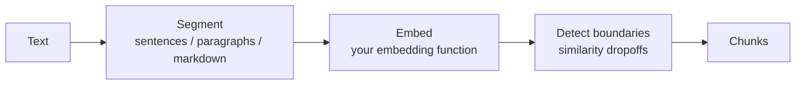

# Semantic Chunker

> Previously published as `semantic-chunker` (last release 0.0.4, now deprecated).
> Renamed to `@johnhenry/semantic-chunker` and restarted at 0.0.0 on import into
> the @johnhenry family — a new address and era, not a maturity signal.

Semantic Chunker is a versatile library for dividing text into semantically meaningful chunks. It employs a BYOE (Bring Your Own Embedder) approach, allowing users to provide their own embedding function that maps text to a vector space.

## Table of Contents

- [Semantic Chunker](#semantic-chunker)
  - [Table of Contents](#table-of-contents)
  - [Installation](#installation)
  - [Features](#features)
  - [Understanding Semantic Chunking](#understanding-semantic-chunking)
  - [Getting Started](#getting-started)
  - [Usage](#usage)
    - [Semantic Chunker](#semantic-chunker-1)
    - [Other Chunkers](#other-chunkers)
      - [Sentence Chunker](#sentence-chunker)
      - [Full Chunker](#full-chunker)
  - [API](#api)
    - [`semantic(options)`](#semanticoptions)
    - [`sentence(options)`](#sentenceoptions)
    - [`full(options)`](#fulloptions)
    - [Boundary Detection Methods](#boundary-detection-methods)
  - [Embedding Functions](#embedding-functions)
    - [Bundled Adapters](#bundled-adapters)
    - [Example: Local Embedding](#example-local-embedding)
    - [Example: External API Call](#example-external-api-call)
  - [How-to Guides](#how-to-guides)
    - [How to Use a Custom Embedding Function](#how-to-use-a-custom-embedding-function)
    - [How to Adjust Chunk Size](#how-to-adjust-chunk-size)
    - [How to Choose a Detection Method](#how-to-choose-a-detection-method)
    - [How to Chunk Markdown](#how-to-chunk-markdown)
  - [Demo](#demo)
  - [Testing](#testing)
  - [Contributing](#contributing)
  - [Changelog](#changelog)
  - [License](#license)

## Installation

To install Semantic Chunker, use npm:

```bash
npm install @johnhenry/semantic-chunker
```

> [!IMPORTANT]
> Semantic Chunker requires **Node.js >= 20.6.0**.

## Features

- Flexible chunking based on semantic meaning
- Support for custom embedding functions (BYOE)
- Multiple chunking strategies: semantic, sentence-based, and full
- Eleven boundary detection methods, from z-scores to change-point analysis
- Sentence, paragraph, or markdown-aware segmentation
- Chunk overlap and minimum/maximum chunk-size enforcement

## Understanding Semantic Chunking

Semantic chunking is a technique used to divide text into meaningful segments based on their semantic content. Unlike simple methods that split text based on character or word count, semantic chunking aims to keep related ideas together and separate distinct concepts.

The importance of semantic chunking in natural language processing and text analysis includes:

1. Preserving context within chunks
2. Identifying natural boundaries between ideas
3. Facilitating more accurate analysis of document structure
4. Improving the performance of downstream NLP tasks (retrieval, RAG, summarization)

Semantic Chunker uses a three-step process:



1. **Segmentation**: The text is split into base units — sentences by default, or paragraphs / markdown blocks via `splitMode`.
2. **Embedding**: Each segment is converted into a vector representation (embedding) that captures its semantic meaning using the provided embedding function.
3. **Boundary detection**: The chunker measures the cosine similarity between adjacent segments. Where similarity drops significantly — as judged by the configured [detection method](#boundary-detection-methods) — it marks a chunk boundary and regroups the segments into chunks.

## Getting Started

Here's a quick tutorial to get you started with Semantic Chunker:

1. Install Semantic Chunker:

```bash
npm install @johnhenry/semantic-chunker
```

2. Create a simple script (e.g., `semantic_chunker_demo.mjs`):

```javascript
import semantic from "@johnhenry/semantic-chunker";

// Simple embedding function (for demonstration purposes)
function simpleEmbed(text) {
  return Promise.resolve(Array.from({ length: 10 }, () => Math.random()));
}

const text = `Semantic Chunker is a powerful tool for text analysis. 
It breaks down text into meaningful segments. 
This helps in understanding the structure and content of documents.`;

const chunker = semantic({ embed: simpleEmbed, zScoreThreshold: 1 });

for await (const [chunk, embedding] of chunker(text)) {
  console.log("Chunk:", chunk);
  console.log("Embedding:", embedding);
  console.log("---");
}
```

3. Run the script:

```bash
node semantic_chunker_demo.mjs
```

You should see output showing the chunks of text along with their embeddings.

> [!TIP]
> A random embedder produces random chunk boundaries — it's only useful for seeing the API shape. Plug in a real embedding model (see [Embedding Functions](#embedding-functions)) for meaningful results.

## Usage

### Semantic Chunker

The main chunker that divides text based on semantic meaning:

```javascript
import semantic from "@johnhenry/semantic-chunker";

const embed = // ... your embedding function
const document = // ... your input text

const chunker = semantic({ embed, zScoreThreshold: 1 });

for await (const [text, embedding] of chunker(document)) {
  console.log({ text, embedding });
}
```

### Other Chunkers

#### Sentence Chunker

Divides the text into sentence-level chunks:

```javascript
import { sentence } from "@johnhenry/semantic-chunker";

const embed = // ... your embedding function
const chunker = sentence({ embed });

// Usage same as semantic chunker
```

#### Full Chunker

Returns the entire document as a single chunk:

```javascript
import { full } from "@johnhenry/semantic-chunker";

const embed = // ... your embedding function
const chunker = full({ embed });

// Usage same as semantic chunker
```

## API

### `semantic(options)`

Creates a semantic chunker.

- Parameters:
  - `options` (Object):
    - `embed` (Function): Takes a string and returns a vector (or a Promise of one). Required for meaningful results.
    - `method` (String): [Boundary detection method](#boundary-detection-methods). Default: `"SD"`.
    - `methodOptions` (Object): Options for the chosen detection method.
    - `zScoreThreshold` (Number): Convenience threshold for the default `"SD"` method. Default: `2`.
    - `split` (Number): Force a split after this many characters. Optional.
    - `splitMode` (String): `"sentence"` (default), `"paragraph"`, or `"markdown"`.
    - `overlap` (Number): Number of trailing segments from the previous chunk to prepend to the next. Default: `0`.
    - `maxChunkSize` (Number): Maximum chunk length in characters; oversized chunks are split at their weakest interior point. `0` (default) disables.
    - `minChunkSize` (Number): Minimum chunk length in characters; undersized chunks are merged into their most-similar neighbor. `0` (default) disables.
- Returns: (AsyncGenerator): Yields `[chunk, embedding]` pairs.

### `sentence(options)`

Creates a sentence chunker.

- Parameters:
  - `options` (Object):
    - `embed` (Function): Takes a string and returns a vector (or a Promise of one).
    - `split` (Number): Force a split after this many characters. Optional.
    - `splitMode` (String): `"sentence"` (default), `"paragraph"`, or `"markdown"`.
- Returns: (AsyncGenerator): Yields `[chunk, embedding]` pairs.

### `full(options)`

Creates a full chunker that returns the entire document as a single chunk.

- Parameters:
  - `options` (Object):
    - `embed` (Function): Takes a string and returns a vector (or a Promise of one).
    - `split` (Number): Force a split after this many characters. Optional.
- Returns: (AsyncGenerator): Yields a single `[chunk, embedding]` pair (or several when `split` is set).

### Boundary Detection Methods

Pass `method` (and optionally `methodOptions`) to `semantic()` to choose how significant similarity dropoffs are identified:

```javascript
const chunker = semantic({
  embed,
  method: "MAD",
  methodOptions: { madMultiplier: 3 },
});
```

| Method             | Strategy                                             | `methodOptions`                                    |
| ------------------ | ---------------------------------------------------- | -------------------------------------------------- |
| `"SD"` (default)   | Z-score against mean/standard deviation              | `zScoreThreshold` (2)                               |
| `"IQ"`             | Interquartile-range outliers                         | `iqrMultiplier` (1.5)                               |
| `"MAD"`            | Median absolute deviation outliers                   | `madMultiplier` (3)                                 |
| `"PercentChange"`  | Percentage drop versus the previous dropoff          | `percentThreshold` (20)                             |
| `"MA"`             | Deviation below a moving average                     | `windowSize` (3), `deviationThreshold` (1.5)        |
| `"LM"`             | Local minima detection                               | `sensitivity` (0.2)                                 |
| `"CUSUM"`          | Cumulative sum of deviations from the mean           | `threshold` (5)                                     |
| `"ChangePoint"`    | Single change point maximizing mean difference       | —                                                   |
| `"Hampel"`         | Hampel filter (windowed median + MAD)                | `windowSize` (7), `nSigma` (3)                      |
| `"ModifiedZScore"` | Modified z-score (median/MAD based)                  | `threshold` (3.5)                                   |
| `"Agentic"`        | Re-embeds segment text with a transformers.js model  | `model`, `threshold` (0.5), `windowSize` (2)        |

> [!NOTE]
> The `"Agentic"` method requires the optional peer dependency [`@huggingface/transformers`](https://www.npmjs.com/package/@huggingface/transformers) (`npm install @huggingface/transformers`). It is loaded lazily, so the rest of the library works without it.

> [!WARNING]
> Do not combine the `"Agentic"` method with the bundled `semantic-chunker/embed/xenova` adapter. The onnxruntime bindings shipped by `@xenova/transformers` (v2) and `@huggingface/transformers` (v3) conflict in the same process: once v3 has run inference, subsequent v2 inference hangs forever. When using `"Agentic"`, build your embedding function on `@huggingface/transformers` too (or use a non-onnx embedder such as Ollama).

The raw detection functions are also exported for direct use:

```javascript
import { dropoffMethods } from "@johnhenry/semantic-chunker";

const boundaries = dropoffMethods.findSignificantDropoffsIQ(dropoffs, 1.5);
```

## Embedding Functions

For better or for worse, you'll need to supply your own embedding function with the following signature:

```typescript
type Embed = (text: string) => number[] | Promise<number[]>;
```

The flexibility of bringing your own embedder (BYOE) allows you to:

1. Use domain-specific embedding models that may perform better for your particular use case.
2. Leverage the latest embedding techniques without requiring updates to the Semantic Chunker library itself.
3. Control the trade-off between embedding quality and computational resources.

### Bundled Adapters

Two ready-made adapters ship with the package as subpath imports. Each requires its optional peer dependency:

```javascript
import { embed } from "@johnhenry/semantic-chunker/embed/xenova"; // needs @xenova/transformers
import { embed } from "@johnhenry/semantic-chunker/embed/ollama"; // needs ollama
```

### Example: Local Embedding

`semantic-chunker/embed/xenova` creates an embedding function using a local transformer model.

For this example to work, in addition to the [`@xenova/transformers` npm package](https://www.npmjs.com/package/@xenova/transformers),
you will need to obtain a [read-access token from Hugging Face](https://huggingface.co/settings/tokens) and set it to the `HF_ACCESS_TOKEN` environment variable.

```bash
export HF_ACCESS_TOKEN=<your_access_token>
```

Upon first run, it will take a while to download the [`Supabase/gte-small` model](https://huggingface.co/Supabase/gte-small), but subsequent runs will be much faster.

### Example: External API Call

`semantic-chunker/embed/ollama` creates an embedding function using an external API call.

For this example to work, in addition to the [`ollama` npm package](https://www.npmjs.com/package/ollama),
you will need to install and run [ollama](https://ollama.com/)
and pull the latest [`nomic-embed-text` model](https://ollama.com/library/nomic-embed-text).

## How-to Guides

### How to Use a Custom Embedding Function

1. Create your embedding function:

```javascript
async function customEmbed(text) {
  // Your embedding logic here
  // This example uses a hypothetical API
  const response = await fetch("https://your-embedding-api.com/embed", {
    method: "POST",
    body: JSON.stringify({ text }),
    headers: { "Content-Type": "application/json" },
  });
  return response.json();
}
```

2. Use your custom embedding function with Semantic Chunker:

```javascript
import semantic from "@johnhenry/semantic-chunker";

const chunker = semantic({ embed: customEmbed });

// Use the chunker as before
for await (const [chunk, embedding] of chunker(yourText)) {
  // Process your chunks
}
```

### How to Adjust Chunk Size

Tune the boundary threshold for the default `"SD"` method with `zScoreThreshold`:

1. For smaller chunks (more granular):

```javascript
const chunker = semantic({ embed: yourEmbedFunction, zScoreThreshold: 0.5 });
```

2. For larger chunks:

```javascript
const chunker = semantic({ embed: yourEmbedFunction, zScoreThreshold: 2.5 });
```

Or enforce hard limits and add context overlap:

```javascript
const chunker = semantic({
  embed: yourEmbedFunction,
  maxChunkSize: 2000, // split chunks longer than 2000 characters
  minChunkSize: 200, // merge chunks shorter than 200 characters
  overlap: 1, // repeat the last segment of each chunk in the next one
});
```

Experiment with different values to find the optimal configuration for your specific use case.

### How to Choose a Detection Method

- Start with the default `"SD"`; it works well when dropoffs are roughly normally distributed.
- If a few extreme outliers skew the results, try the robust `"MAD"` or `"ModifiedZScore"`.
- For long documents with gradual topic drift, try `"MA"` (moving average) or `"CUSUM"`.
- To find one dominant topic shift, use `"ChangePoint"`.
- `"Agentic"` re-embeds segment text with a local transformers.js model and is the most expensive option.

### How to Chunk Markdown

Use `splitMode: "markdown"` so headings and fenced code blocks are respected (code blocks are never split in half):

```javascript
const chunker = semantic({
  embed: yourEmbedFunction,
  splitMode: "markdown",
});
```

Use `splitMode: "paragraph"` for plain text organized into paragraphs separated by blank lines.

## Demo

Run a demo with the following command:

```bash
npm run demo
```

Results in [`./docs/demo-results.md`](./docs/demo-results.md).

## Testing

```bash
npm test              # offline unit tests (no network, no models)
npm run test:integration  # requires HF access + a local Ollama server
npm run typecheck     # TypeScript checks over JSDoc + type definitions
```

## Contributing

Contributions are welcome! Please feel free to submit a Pull Request.

## Changelog

### [0.0.4]

- Fixed: `package.json` `exports` map lacked a `types` condition, so TypeScript consumers using `moduleResolution: "NodeNext"` (or `"Node16"`) couldn't find the shipped type declarations ([#1](https://github.com/johnhenry/semantic-chunker/issues/1))

### [0.0.3]

- Fixed: `MAD` detection method crashed with a `ReferenceError`; the full chunker yielded an unresolved Promise as the embedding; cosine similarity returned `NaN` for zero/empty vectors
- Added: `method`/`methodOptions` options exposing eleven boundary detection methods (including the new `Agentic` method)
- Added: `overlap`, `maxChunkSize`, `minChunkSize` chunk-shaping options
- Added: `splitMode` option (`sentence`, `paragraph`, `markdown`)
- Added: embed adapters as subpath exports (`semantic-chunker/embed/xenova`, `semantic-chunker/embed/ollama`) backed by optional peer dependencies
- Added: offline unit test suite, gated integration tests, CI, and TypeScript checking
- Changed: accurate type definitions; `engines.node` >= 20.6.0; slimmer npm package

### [0.0.2]

- Demo fixed minor issues with demo and docs

### [0.0.1]

- Demo is more robust and outputs markdown
- Fix documentation for `options.split`
- Add options.split to ful chunker

### [0.0.0]

#### Added

- Initial release of the semantic-chunker package
- Semantic chunker for semantic text division
- Sentence chunker for sentence-level text division
- Full chunker for processing entire documents
- README with usage examples and API documentation
- Basic test suite

## License

This project is licensed under the MIT License - see the [LICENSE](LICENSE) file for details.
